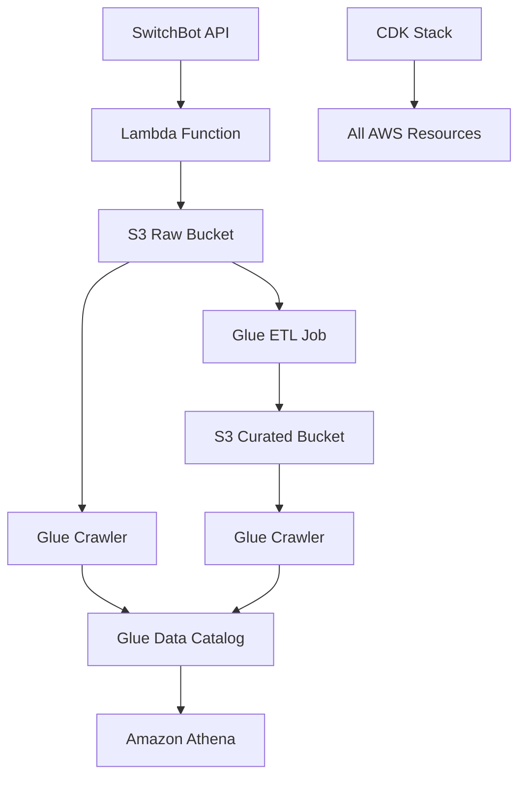

# 設計ドキュメント

## 概要

SwitchBot APIからデータを取得し、AWS Glueを使用してデータパイプラインを構築するシステムの設計。このシステムは、データの取得、蓄積、カタログ化、加工、分析の一連の流れを通じてAWS Glueの理解を深めることを目的とする。

## アーキテクチャ



### アーキテクチャの説明

1. **データ取得層**: Lambda関数がSwitchBot APIからJSONデータを取得
2. **Raw データ層**: 取得したJSONデータをS3 Rawバケットに保存
3. **カタログ層**: Glue CrawlerがS3データをスキャンしてData Catalogにテーブル定義を作成
4. **変換層**: Glue ETL JobがJSONをParquet形式に変換してS3 Curatedバケットに保存
5. **分析層**: Amazon AthenaでSQLクエリを実行してデータを分析
6. **インフラ層**: AWS CDKですべてのリソースを管理

## コンポーネントと インターフェース

### 1. Lambda Function (データ取得)

**責任**:
- SwitchBot APIへのHTTPSリクエスト送信
- 認証トークンとシークレットキーを使用した署名生成
- JSONレスポンスの取得とS3への保存

**インターフェース**:
```typescript
interface SwitchBotApiResponse {
  statusCode: number;
  body: {
    devices?: Device[];
    infraredRemoteList?: InfraredRemote[];
    message?: string;
  };
}

interface Device {
  deviceId: string;
  deviceName: string;
  deviceType: string;
  enableCloudService: boolean;
  hubDeviceId?: string;
}
```

### 2. S3 Buckets

**Raw Bucket**:
- 目的: 元のJSONデータを保存
- 命名規則: `switchbot-raw-data-{timestamp}.json`
- パーティション: `year/month/day/hour`

**Curated Bucket**:
- 目的: 変換されたParquetデータを保存
- 命名規則: `switchbot-curated-data-{timestamp}.parquet`
- パーティション: `year/month/day`

### 3. Glue Crawler

**Raw Data Crawler**:
- 対象: S3 Raw Bucket
- スケジュール: 日次実行
- 出力: Raw データテーブル定義

**Curated Data Crawler**:
- 対象: S3 Curated Bucket
- スケジュール: ETL Job完了後に実行
- 出力: Curated データテーブル定義

### 4. Glue ETL Job

**変換処理**:
- 入力: S3 Raw BucketのJSONファイル
- 処理: JSONからParquetへの変換、データクリーニング
- 出力: S3 Curated BucketのParquetファイル

**スクリプト構造**:
```python
# Glue ETL Job の基本構造
import sys
from awsglue.transforms import *
from awsglue.utils import getResolvedOptions
from pyspark.context import SparkContext
from awsglue.context import GlueContext
from awsglue.job import Job

def transform_switchbot_data(glueContext, input_path, output_path):
    # JSONデータの読み込み
    # データクリーニングと変換
    # Parquet形式での保存
    pass
```

### 5. CDK Infrastructure

**スタック構成**:
- S3バケット（Raw、Curated、Scripts）
- Lambda関数とIAMロール
- Glue Database、Crawler、Job
- 必要なIAMポリシーと権限

## データモデル

### SwitchBot API レスポンス構造

```json
{
  "statusCode": 100,
  "body": {
    "deviceList": [
      {
        "deviceId": "C271111EC0AB",
        "deviceName": "Living Room Humidifier",
        "deviceType": "Humidifier",
        "enableCloudService": true,
        "hubDeviceId": "000000000000"
      }
    ],
    "infraredRemoteList": [
      {
        "deviceId": "02-202008110034-13",
        "deviceName": "Living Room TV",
        "remoteType": "TV",
        "hubDeviceId": "FA7310762361"
      }
    ]
  },
  "message": "success"
}
```

### Raw Data Schema (S3)

```json
{
  "timestamp": "2024-01-06T10:30:00Z",
  "api_response": {
    "statusCode": 100,
    "body": { /* SwitchBot API response */ },
    "message": "success"
  },
  "metadata": {
    "collection_time": "2024-01-06T10:30:00Z",
    "api_version": "v1.1",
    "lambda_request_id": "abc123"
  }
}
```

### Curated Data Schema (Parquet)

```
devices/
├── device_id: string
├── device_name: string
├── device_type: string
├── enable_cloud_service: boolean
├── hub_device_id: string
├── collection_date: date
└── collection_hour: int

infrared_remotes/
├── device_id: string
├── device_name: string
├── remote_type: string
├── hub_device_id: string
├── collection_date: date
└── collection_hour: int
```

## 正確性プロパティ

*プロパティとは、システムのすべての有効な実行において真であるべき特性や動作のことです。本質的には、システムが何をすべきかについての形式的な記述です。プロパティは、人間が読める仕様と機械で検証可能な正確性保証の橋渡しとして機能します。*

### プロパティ反映

プロパティの重複を排除するため、以下の統合を行います：

- プロパティ1.1とプロパティ1.2は、API通信の包括的なプロパティに統合
- プロパティ2.1とプロパティ2.2は、S3保存の包括的なプロパティに統合  
- プロパティ4.2は、JSONからParquetへの変換に関するround-tripプロパティとして独立
- エラーハンドリング関連のプロパティ（1.3, 2.3, 3.4, 4.4, 5.4）は、エラー処理の包括的なプロパティに統合
- ログ出力関連のプロパティ（1.4, 2.4, 4.5）は、ログ記録の包括的なプロパティに統合

### プロパティ一覧

**プロパティ1: API通信とデータ取得**
*任意の* Lambda関数実行において、SwitchBot APIへのHTTPSリクエストが送信され、有効なJSONレスポンスが取得される
**検証対象: 要件 1.1, 1.2**

**プロパティ2: データ保存とファイル命名**
*任意の* JSONデータに対して、S3 Raw Bucketへの保存が実行され、ファイル名にタイムスタンプが含まれる
**検証対象: 要件 2.1, 2.2**

**プロパティ3: Crawlerによるスキーマ分析**
*任意の* Glue Crawler実行において、S3バケットのJSONファイル構造が分析され、Athenaで使用可能なテーブル定義が作成される
**検証対象: 要件 3.1, 3.2**

**プロパティ4: スキーマ自動更新**
*任意の* 新しいデータ追加において、Glue Crawlerがテーブル定義を自動更新する
**検証対象: 要件 3.3**

**プロパティ5: データ変換round-trip**
*任意の* 有効なSwitchBotデバイスデータに対して、JSONからParquetに変換してからJSONに戻すことで、元のデータ構造と内容が保持される
**検証対象: 要件 4.2**

**プロパティ6: ETL処理フロー**
*任意の* Glue Job実行において、Raw BucketのJSONファイルが読み込まれ、変換完了後にCurated BucketにParquetファイルが保存される
**検証対象: 要件 4.1, 4.3**

**プロパティ7: Athenaクエリ実行**
*任意の* SQLクエリ実行において、Raw BucketまたはCurated Bucketのデータが検索対象となり、適切な形式で結果が返される
**検証対象: 要件 5.1, 5.2**

**プロパティ8: CDKリソース作成**
*任意の* CDKスタックデプロイメントにおいて、必要なS3バケット、Lambda関数、Glueリソースが作成され、適切なIAMロールとポリシーが自動生成される
**検証対象: 要件 6.2, 6.3**

**プロパティ9: リソースクリーンアップ**
*任意の* 環境削除操作において、CDKを使用してすべてのリソースが適切にクリーンアップされる
**検証対象: 要件 6.4**

**プロパティ10: 包括的エラーハンドリング**
*任意の* エラー発生時（API失敗、S3保存失敗、テーブル定義作成失敗、データ変換失敗、クエリ失敗）において、適切なエラーログが出力され、必要に応じてリトライ処理や処理停止が実行される
**検証対象: 要件 1.3, 2.3, 3.4, 4.4, 5.4**

**プロパティ11: 包括的ログ記録**
*任意の* 正常処理完了時（Lambda実行、データ保存、変換処理）において、適切なタイムスタンプとログが記録される
**検証対象: 要件 1.4, 2.4, 4.5**

## エラーハンドリング

### エラー分類と対応

**1. API通信エラー**
- SwitchBot API接続失敗
- 認証エラー（無効なトークン/シークレット）
- レート制限エラー
- 対応: 指数バックオフによるリトライ、エラーログ出力

**2. データ処理エラー**
- 無効なJSONレスポンス
- S3保存失敗
- データ変換エラー
- 対応: エラーログ出力、Dead Letter Queueへの送信

**3. インフラストラクチャエラー**
- Glue Job実行失敗
- Crawler実行失敗
- Athenaクエリエラー
- 対応: CloudWatchアラーム、自動リトライ

### エラー監視

- CloudWatchメトリクスによる監視
- Lambda関数のエラー率追跡
- Glue JobとCrawlerの失敗率監視

## テスト戦略

### 二重テストアプローチ

**ユニットテスト**:
- 基本的な機能動作を検証
- Lambda関数の主要機能テスト
- Glue ETLスクリプトの変換ロジックテスト

**プロパティベーステスト**:
- すべての入力に対する汎用プロパティを検証
- 最低100回の反復実行
- 各プロパティテストは設計ドキュメントのプロパティを参照
- タグ形式: **Feature: switchbot-data-pipeline, Property {number}: {property_text}**

### テストライブラリ

**TypeScript/JavaScript**: fast-check
**Python**: Hypothesis

### テスト設定

- 各プロパティテストは最低10回の反復実行
- 基本的な機能検証に焦点
- 正確性検証にはプロパティテスト